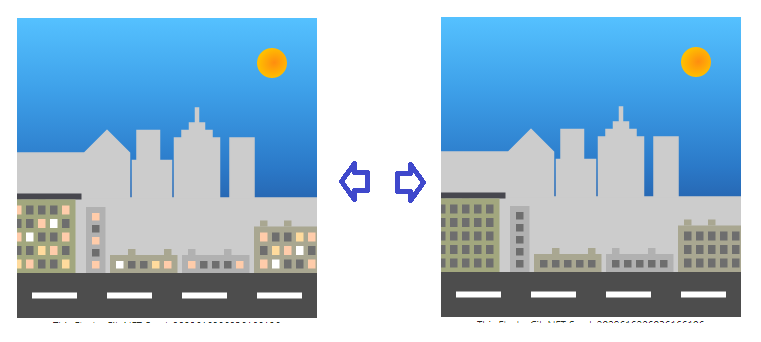
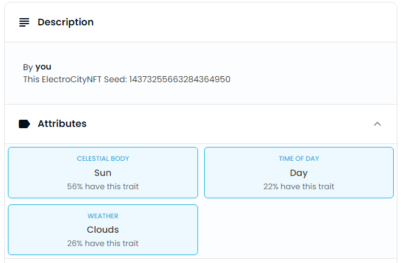

# 🏗 scaffold-eth - 🔵 ElectroCity SVG NFT

## History of the token's creation
              
When I started the NFT SVG challenge, I didn't have thoughts about what to draw. I'm Ukrainian and still be in Ukraine. We constantly have a blackout due to rocket attacks from russia.

[Austin Griffith](https://www.youtube.com/@austingriffith3550) knew about that and suggested creating an NFT that would reflect the availability of electricity in my home.
I decided to make an apartment building with lights on and off.
In the process, I chose to add a background (a sun or a moon) and more different buildings.

The next step was to write a script that turns the lights on and off in the contract.
The script runs in the cloud in another country.
It's trying to access the site's page running at my house on Raspberry PI.
Depending on the site's response, the script changes the state of the light in the contract if it's different from the current one.

## Token generation. Image and Properties

For a mint token, you need to call the mint method on the contract with an arbitrary amount of Matic (minimum 0.1) or transfer any amount in Matic (minimum 0.1) to the token contract.
The maximum tokens’ number is 1000. Tokens are displayed on the OpenSea website, where you can trade with them.



In the contract, "seed" (byte 8) is stored for each token.
Method tokenURI generates an SVG based on "seed"
It also generates four groups of values "Celestial Body", "Time of Day", "Weather", and "Cosmos". They are also counted based on seed.



```bash
git clone git@github.com:Sergik666/scaffold-eth-examples.git svg-nft

cd svg-nft

git checkout electro-city-nft
```

```bash

yarn install

```

```bash

yarn start

```

> in a second terminal window:

```bash
cd svg-nft

yarn chain

```

---

> in a third terminal window:


```bash
cd svg-nft

yarn deploy

```

📱 Open http://localhost:3000 to see the app

Site demo:
https://sergik666-electro-city-nft