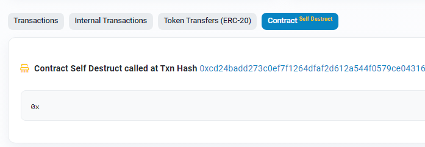
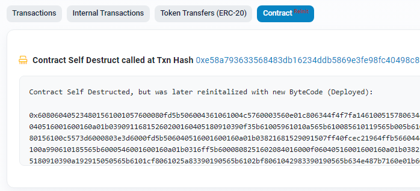
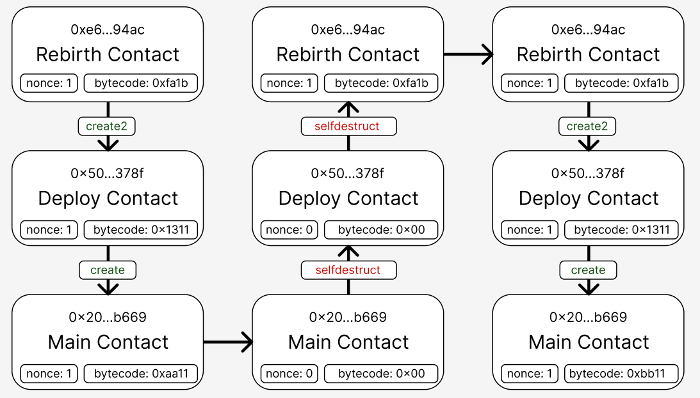

# 🏗 scaffold-eth - 🔵 Rebirth Contract

## Description

Reloading the contract at the same address.

# Theory

## Nonce

Sequence number of transactions.

## [Create](https://www.evm.codes/#f0?fork=shanghai)
 
To create a contract address, use the sender address and sender nonce.

How is the address calculated:

```python
address = keccak256(rlp([sender_address,sender_nonce]))[12:]
```

To create a contract you must specify "new" and the name of the contract class.

Example of the contract’s creating and converting to an address:

```solidity
address(new ContractA());
```

To create a contract based on byte code, you can use the low-level method:

```solidity
address contractAddress;
assembly {
    contractAddress := create(0, add(bytecode, 0x20), mload(bytecode))
}
```

## [Create 2](https://www.evm.codes/#f5?fork=shanghai)

To create a contract address, use the sender address, salt and hash (from the bytecode of the contract)

How is the address calculated:

```python
initialisation_code = memory[offset:offset+size]
address = keccak256(0xff + sender_address + salt + keccak256(initialisation_code))[12:]
```

To create a contract, you must specify “new”, the name of the contract and salt.

Example of the contract’s creating and converting to an address:


```solidity
 address(new ContractDeployer{salt: SALT}());
```

## [selfdestruct](https://www.evm.codes/#ff?fork=shanghai)

Deleting the contract byte code and resetting the nonce, the contract funds are sent to the specified address.

Usage example:

```solidity
selfdestruct(payable(parent));
```

# Displays in etherscan



Deleted contract is marked 'selfdestruct'.



Reloaded contract is marked with 'reinit'

# How can we use it

With create2 we can create a contract with the same addresses. Using the create method and the same nonce creates a contract at the same address. With selfdestruct we can delete this contract. Zeroing the nonce and reloading it with the zeroed nonce. You can already download an arbitrary contract at the same address.

# How it works in the example

We have a main contract for restore [Rebirth Contract](https://sepolia.etherscan.io/address/0xE690D00A1ae04B2aa0a2B903980360D4981b94ac) that loads a contract to load other contracts [Deploy Contract](https://sepolia.etherscan.io/address/0x50C56Ec20478fE29b069B7223005de97bFD0378f).
To deploy "Deploy Contract" use the same address, salt and same contract bytecode.

"Deploy Contract" deployed "Contract A", "Contract B" or bytecode. And deployed contract ["Main Contract" address](https://sepolia.etherscan.io/address/0x20D50924B373978162DF1AFc079f0c9A62Fcb669) always has the same address on condition the nonce is equal 0, and this address doesn't have any other contract.

To update the "master contract" at the same address, you need to delete the previous "Main Contract" and "Deploy Contract" (use the "selfdestruct" method).
After the destruction of the contract, its "nonce" is reset, so the new "Main Contract" will receive the same address.

## Step by step

1. "Rebirth Contract" click "Deploy"
2. "Deploy Contract" click "Deploy Contract A"
3. "Main Contract" click "Destroy"
4. "Deploy Contract" click "Destroy"
5. "Rebirth Contract" click "Deploy"
6. "Deploy Contract" click "Deploy Bytecode"



## Testing

Checking the contract’s loading on the same address is included into the tests

## Installation

```bash
git clone git@github.com:Sergik666/scaffold-eth-examples.git contract-rebirth

cd contract-rebirth

git checkout contract-rebirth
```

```bash

yarn install

```

```bash

yarn start

```

> in a second terminal window:

```bash
cd contract-rebirth

yarn chain

```

---

> in a third terminal window:


```bash
cd contract-rebirth

yarn deploy

```

📱 Open http://localhost:3000 to see the app


For testing

> in a fourth terminal window:
```bash
yarn test
```

Site demo:
https://sergik666-rebirth-contract.surge.sh
